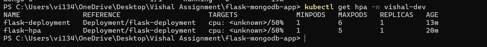
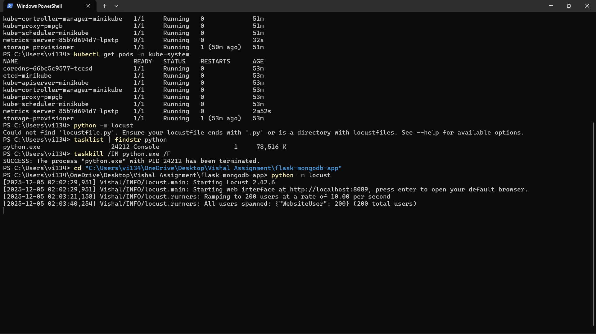
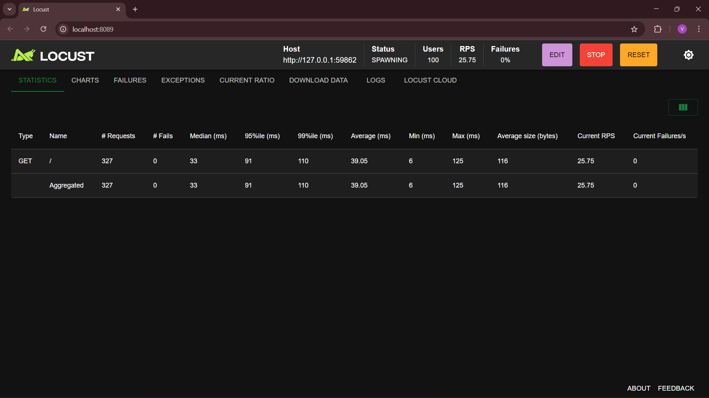
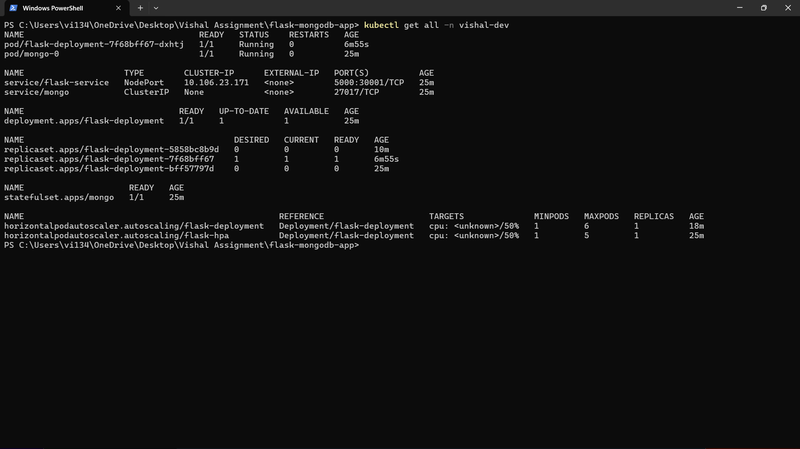
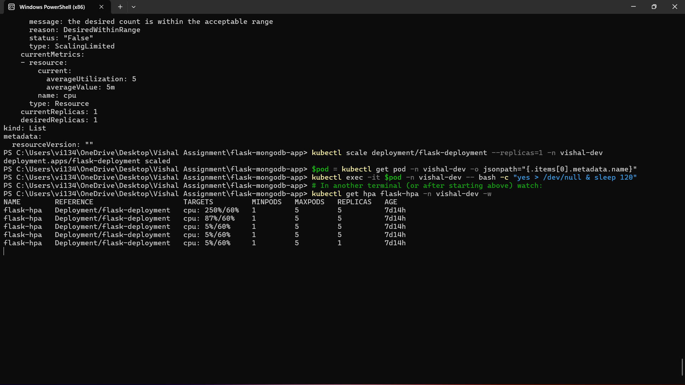

Flask + MongoDB Application (Docker + Kubernetes + Minikube)

This project implements a simple REST API using Flask with MongoDB as the database.
The application is fully containerized using Docker and deployed on Kubernetes using Minikube.
All endpoints are tested using Postman.

Features :- 
1. Flask REST API
2.MongoDB database (StatefulSet)
3.Dockerized backend
4.Kubernetes deployment
5.Persistent storage using PV/PVC
6.Internal service communication
6.Horizontal Pod Autoscaling (HPA)
7.ested locally using Minikube and Postman

📂 Project Structure
flask-mongodb-app/
├── app.py
├── Dockerfile
├── requirements.txt
├── README.md
└── k8s/
    ├── mongo-pv.yaml
    ├── mongo-pvc.yaml
    ├── mongo-service.yaml
    ├── mongo-statefulset.yaml
    ├── flask-deployment.yaml
    ├── flask-service.yaml
    └── hpa.yaml

🧪 API Endpoints
Health Check
GET /

List Items
GET /items

Create Item
POST /items
Body:
{
  "name": "example item"
}

🐳 Docker Setup
1. Build Docker Image
docker build -t flask-mongo-app:latest .
2. Run MongoDB (No Authentication)
docker run -d --name mongo -p 27017:27017 mongo:6.0
3. Run Flask App
docker run -d --name flask-app \
  -p 5000:5000 \
  -e MONGO_HOST=mongo \
  -e MONGO_DB=flaskdb \
  --link mongo:mongo \
  flask-mongo-app:latest

☸️ Kubernetes Deployment (Minikube)
1. Start Minikube
minikube start --driver=docker
kubectl get nodes
2. Load Local Docker Image Into Minikube
minikube image load flask-mongo-app:latest

🗄️ Deploy MongoDB
Apply required volumes, service, and StatefulSet:

kubectl apply -f k8s/mongo-pv.yaml
kubectl apply -f k8s/mongo-pvc.yaml
kubectl apply -f k8s/mongo-service.yaml
kubectl apply -f k8s/mongo-statefulset.yaml

Check pod status:
kubectl get pods

Expected:
mongo-0   Running

🟦 Deploy Flask Application
kubectl apply -f k8s/flask-deployment.yaml
kubectl apply -f k8s/flask-service.yaml
kubectl apply -f k8s/hpa.yaml
Check:

kubectl get pods
kubectl get svc

🌐 Access Flask API in Kubernetes
Expose service:
minikube service flask-service
Minikube will open or print a URL like:
http://127.0.0.1:52031

Test Endpoints:
GET http://127.0.0.1:52031/
GET http://127.0.0.1:52031/items
POST http://127.0.0.1:52031/items

Example POST body:

{
  "name": "k8s item"
}

📦 Horizontal Pod Autoscaler (HPA)
kubectl get hpa
Automatically scales flask-deployment between 1–5 replicas based on CPU usage.

📊 Sample Output

Response from API running in Kubernetes:

[
  {
    "_id": "69282c315b9bfaeb80ae41a4",
    "name": "test item"
  },
  {
    "_id": "69282c4d5b9bfaeb80ae41a5",
    "name": "k8s item"
  }
]

SCREENSHOTS :- 

### Kubernetes Pods Running Initially

command used :- kubectl get pods -n vishal-dev

### HPA Monitoring Scaling in Real-Time

command used :- kubectl get hpa -n vishal-dev -w

### Locust Load Test Running (200 Users)

command used :- locust -f locustfile.py

### Locust Load Test Running (200 Users)

### Autoscaled Pods After High Load

command used :- kubectl get pods -n vishal-dev

### HPA Fixed

🧹 Cleanup
Stop Minikube:
minikube stop

Delete Minikube cluster:
minikube delete

✅ Summary

This project demonstrates:

Backend development (Flask)
Database integration (MongoDB)
Containerization (Docker)
Kubernetes deployment (Minikube)
Persistent storage (PV/PVC, StatefulSet)
API testing (Postman)
Autoscaling (Horizontal Pod Autoscaler)